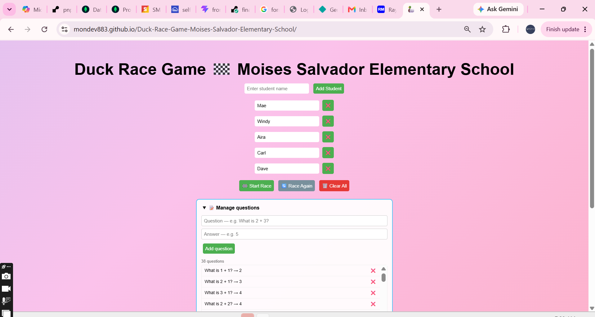
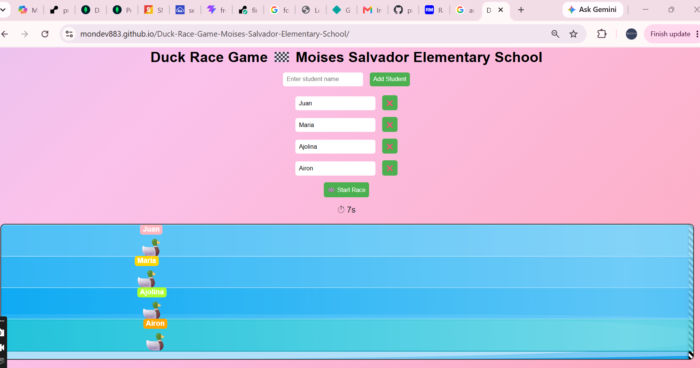
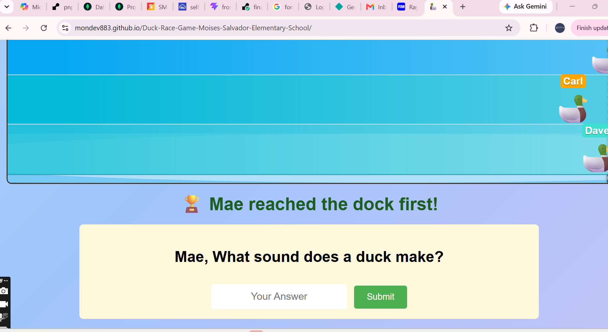
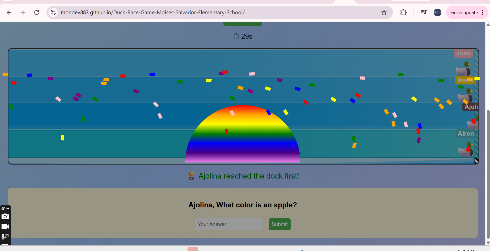

# 🦆 Duck Race Game

A browser game built for kindergarten pupils at **Moises Salvador Elementary
School**. Children's names are entered, their ducks race across the water, and
the winner answers a question in front of the class.

No install, no accounts, no internet needed after the first load — it runs from
a single HTML file on whatever computer the classroom has.

**Play:** https://mondev883.github.io/Duck-Race-Game-Moises-Salvador-Elementary-School/

---

## 📸 Screenshots

| Setup | Race in progress |
|---|---|
|  |  |

| Winner and question | Celebration |
|---|---|
|  |  |

---

## How it plays

1. The teacher types each child's name and adds them to the list
2. Everyone gets a duck, a coloured lane and a name label
3. **Start Race** — ducks move up the screen, quacking and flashing as they go
4. The first duck to reach the dock wins
5. The winner is asked a question — counting, colours, shapes, or animal sounds
6. Confetti, a rainbow and a victory sound

Names can be edited or removed before the race starts, so a mistyped name
doesn't mean starting over.

---

## Why the race is random

This is the decision the whole game rests on.

Each duck advances by a random amount every tick:

```js
const step = 2 + Math.random() * 4;
```

The race isn't a test. It doesn't reward the fastest reader or the child who
already knows their numbers. Every pupil has the same chance of winning, which
means the quiet ones win as often as the confident ones.

**The question comes after the race, not during it.** It's the winner's prize —
a moment in front of the class — rather than an obstacle that decides the
outcome. A child who answers wrong still won the race.

For five- and six-year-olds, that difference matters. A game where the same
three children always win teaches the rest that they're not good at it.

---

## The questions

Around forty, grouped by what they practise:

| Group | Examples |
|---|---|
| Simple addition | `1 + 1`, `3 + 2`, `5 + 2` |
| Counting | How many fingers on one hand? Days in a week? |
| Body parts | How many eyes, ears, noses do you have? |
| Colours | What colour is the sky, a banana, grass? |
| Animal sounds | What sound does a duck, cow, pig make? |
| Number sequence | What comes after 4? |
| Shapes | What shape has 3 sides? |
| Local | How many letters are in the Filipino alphabet? |

One question accepts several answers, because there's more than one way a
five-year-old might say it:

```js
{
  q: "What is the name of your beautiful teacher?",
  a: ["grace", "ms grace", "teacher grace"]
}
```

`checkAnswer` handles both shapes — a single string or an array of accepted
answers:

```js
isCorrect = Array.isArray(correctAnswer)
  ? correctAnswer.includes(answer)
  : answer === correctAnswer.toLowerCase();
```

Answers are lowercased and trimmed before comparison, so capitalisation and
stray spaces don't count against a child still learning to type.

---

## Built with

Plain HTML, CSS and JavaScript. No framework, no build step, no dependencies.

That was deliberate. The school computer runs whatever it runs, and a game
that's one folder of files will still work in five years without an
`npm install`.

**Techniques used:**

- `setInterval` driving the race loop at 100ms
- DOM elements created and positioned per racer, so the number of lanes matches
  the number of children
- CSS transitions for the duck's scale and glow on each quack
- Confetti generated as 60 divs with randomised colour, position and fall speed
- HTML5 `<audio>` for the quack and victory sounds

---

## Running it

Download or clone, then open `index.html`. That's the whole setup.

```bash
git clone https://github.com/MonDev883/Duck-Race-Game-Moises-Salvador-Elementary-School.git
```

**Two notes on sound:** browsers block audio until the user interacts with the
page, so the first quack only plays after the teacher clicks Start. And
`.play()` returns a promise that rejects if the browser refuses — those
rejections are caught so a blocked sound never stops the race.

---

## Known limitations

Being honest about what I'd fix next:

- **A wrong answer closes the question box.** It says "try again" but doesn't
  actually let them. The box should stay open until the answer is right, or
  until the teacher moves on.
- **No restart button.** Running a second race means reloading the page, which
  clears the name list too.
- **Names go into the DOM with `innerHTML`.** A name containing a quote
  character would break the input. `textContent` and `createElement` would be
  the correct approach.
- **Questions are hardcoded.** A teacher can't add their own without editing
  the JavaScript.

---

## Why I built it

I wanted to make something for a specific room of specific children rather than
for a portfolio. The constraints were real: it had to run on a school computer,
work without internet, be operable by a teacher who wasn't going to read
instructions, and hold the attention of five-year-olds.

Most of the design decisions above came from those constraints rather than from
anything I'd read about game design.

---

## License

MIT
